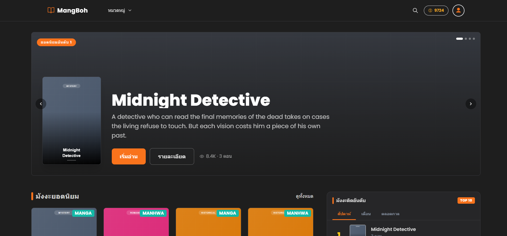
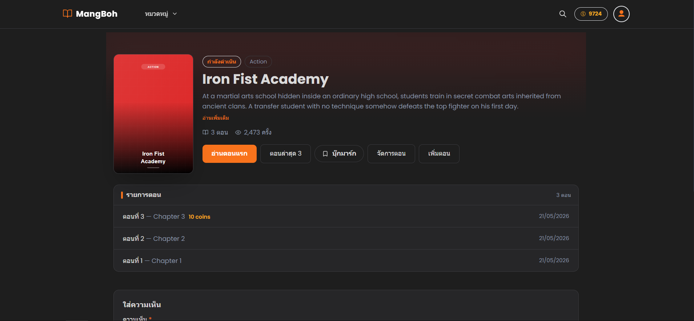
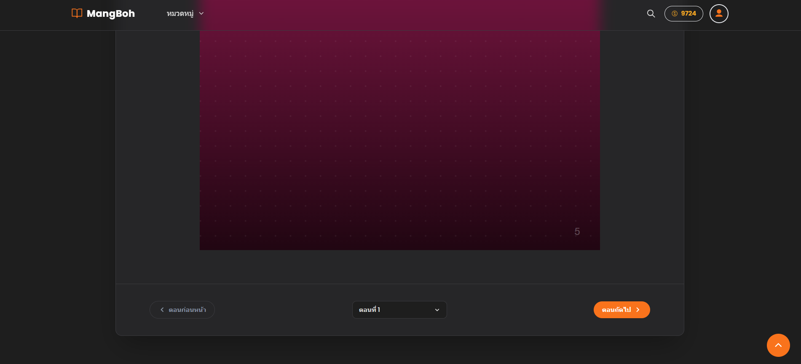
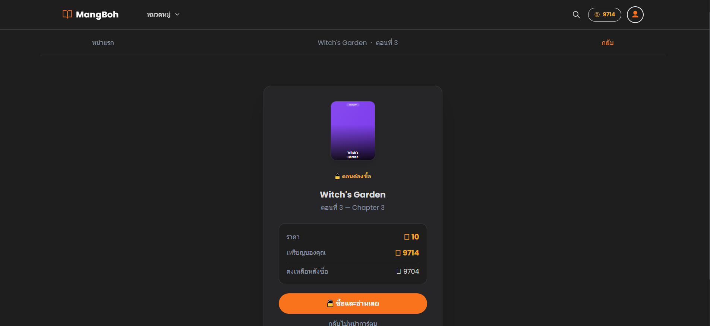
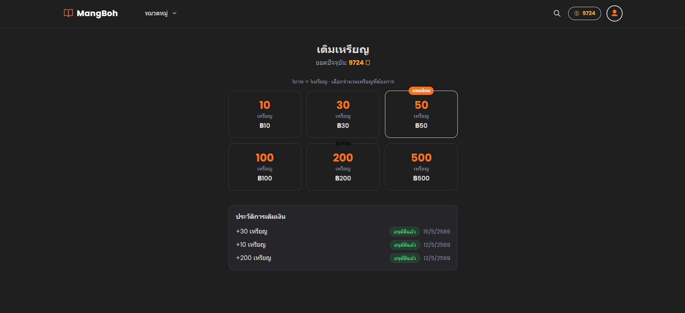
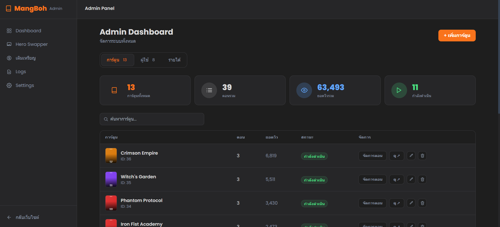

# MangBoh — แพลตฟอร์มอ่านมังงะออนไลน์

เว็บไซต์อ่านมังงะ, มังฮวา, มันฮวา ภาษาไทย  
รองรับระบบสมาชิก, ระบบเหรียญ, บทที่ต้องซื้อ, และ Admin Dashboard สำหรับจัดการเนื้อหา

---

## Homepage



หน้าหลักแสดง Hero Banner พร้อมมังงะ Featured, มังงะยอดนิยม และรายการอัพเดทล่าสุด  
ผู้ใช้สามารถค้นหาและกรองมังงะตามแนว (Genre) ได้

---

## หน้ารายละเอียดมังงะ



แสดงข้อมูลปก, คำอธิบาย, แนวมังงะ, สถานะ (กำลังดำเนิน/จบแล้ว) และรายการตอนทั้งหมด  
มีระบบ Comment และ Bookmark พร้อมปุ่มอ่านตอนแรก/ตอนล่าสุดได้ทันที

---

## หน้าอ่านมังงะ (Reader)



อ่านมังงะแบบ scroll ยาวต่อเนื่อง รองรับทั้ง Manga และ Manhwa  
มี Navigation ตอนก่อนหน้า/ถัดไป และ Dropdown เลือกตอนได้โดยตรง

---

## ระบบปลดล็อคตอน (Paid Chapter)



ตอนที่ต้องเสียเหรียญจะแสดงหน้าสรุปราคาก่อนซื้อ  
แสดงยอดเหรียญปัจจุบัน, ราคาตอน และเหรียญที่เหลือหลังซื้อ

---

## ระบบเติมเหรียญ



เลือกแพ็กเหรียญและชำระผ่าน PromptPay QR  
ระบบแสดงประวัติการเติมเงินพร้อมสถานะอนุมัติจาก Admin

---

## Admin Dashboard



ภาพรวมระบบ: จำนวนการ์ตูน, ตอนรวม, ยอดวิวรวม และรายการกำลังดำเนิน  
จัดการมังงะ, ผู้ใช้, Topup, Hero Image, Logs และตั้งค่าเว็บได้จากหน้าเดียว

---

## Features

- **Homepage** — Hero Banner, มังงะยอดนิยม, อัพเดทล่าสุด
- **Reader** — อ่านแบบ scroll ยาว, รองรับ Manga / Manhwa / Manhua
- **ระบบสมาชิก** — สมัคร/เข้าสู่ระบบ, Google OAuth, รีเซ็ตรหัสผ่านผ่าน OTP
- **Bookmark & Bookshelf** — บันทึกและติดตามมังงะที่อ่าน
- **ระบบเหรียญ** — เติมเงินผ่าน PromptPay, ใช้เหรียญปลดล็อคบท
- **Comment & Rating** — แสดงความคิดเห็นและให้คะแนนมังงะ
- **Admin Dashboard** — จัดการมังงะ, ผู้ใช้, Topup, Hero Image, Log

## Tech Stack

- [Next.js 15](https://nextjs.org/) (App Router)
- TypeScript
- Tailwind CSS
- Prisma ORM + PostgreSQL
- NextAuth v5 (Email + Google OAuth)
- PromptPay QR

## Getting Started

```bash
npm install
npm run dev
```

คัดลอก `.env.example` แล้วตั้งค่าตัวแปร:

```env
DATABASE_URL=
DIRECT_URL=
BLOB_READ_WRITE_TOKEN=
NEXTAUTH_SECRET=
NEXTAUTH_URL=http://localhost:3000
GOOGLE_CLIENT_ID=
GOOGLE_CLIENT_SECRET=
PROMPTPAY_ID=
```

เปิด [http://localhost:3000](http://localhost:3000) ในเบราว์เซอร์

## Seed ข้อมูลตัวอย่าง

```bash
# Local
npm run db:seed

# Production
npm run db:seed:prod
```
